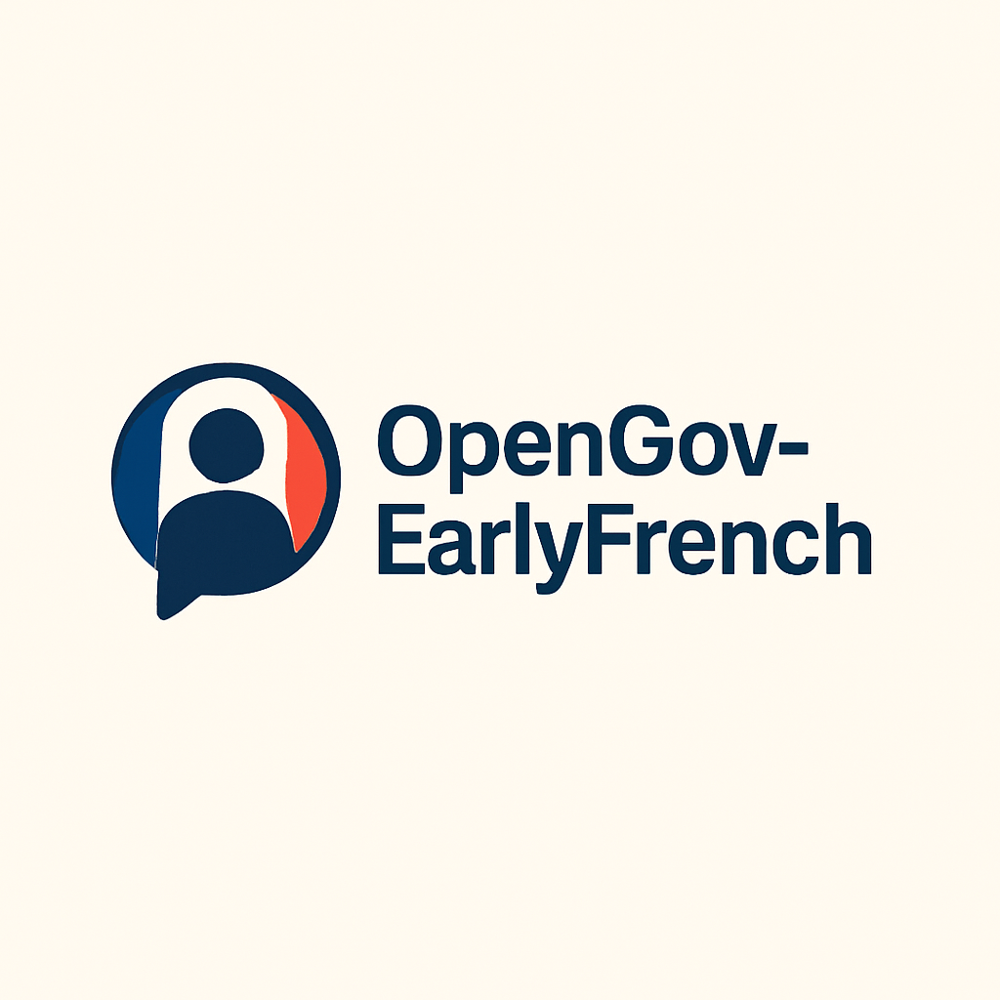

# OpenGov-EarlyFrench

<p align="center">
  
</p>

[](https://github.com/llamasearchai/opengov-earlyfrench/actions/workflows/ci.yml)
[](https://pytest-cov.readthedocs.io/)
[](https://www.python.org/downloads/)
[](https://opensource.org/licenses/MIT)

Comprehensive AI-powered French language learning platform featuring interactive lessons, cultural immersion, business French, and personalized learning paths for learners worldwide.

## Features

### Pronunciation & Phonetics
- Master nasal vowels (an, en, in, on, un)
- Silent letters and pronunciation rules
- Liaison & elision practice
- Accent marks (é, è, ê, à, ù, ç)
- French 'r' sound training
- Regional accents (Metropolitan, Quebec, Belgian, Swiss, African)

### Verb Conjugation
- All 14 tenses and moods
- Regular -er, -ir, -re verbs
- Irregular verb patterns
- Reflexive verbs
- Passé composé formation
- Subjunctive mood practice

### Gender & Articles
- Masculine/Feminine pattern recognition
- Definite, indefinite, and partitive articles
- Article contractions
- Adjective agreement rules
- Exception handling

### AI Conversation Partner
- OpenAI-powered conversation practice
- Adaptive difficulty by CEFR level (A1-C2)
- Real-time grammar feedback
- Cultural context and tips
- Scenario-based learning (café, market, etc.)

### FastAPI Integration
- RESTful API endpoints
- Interactive API documentation
- CORS support
- Health checks
- Comprehensive error handling

## Quick Start

### Installation

```bash
# Clone repository
git clone https://github.com/llamasearchai/opengov-earlyfrench.git
cd opengov-earlyfrench

# Install dependencies
pip install -e .

# Or use uv (recommended)
curl -LsSf https://astral.sh/uv/install.sh | sh
uv pip install -e .

# Set up environment
cp .env.example .env
# Add your OpenAI API key to .env

# Run tests
pytest

# Start the API server
francais serve

# Or use uvicorn directly
uvicorn opengov_earlyfrench.api.main:app --reload
```

### Docker Deployment

```bash
# Build and run with Docker Compose
docker-compose up -d

# Access the application
open http://localhost:8000  # API
open http://localhost:8000/docs  # Interactive API docs
```

## CLI Usage

### Pronunciation Coaching

```bash
# Analyze pronunciation
francais pronunciation --text "Je voudrais un croissant"

# Learn nasal vowels
francais pronunciation --nasal

# Practice liaison
francais pronunciation --liaison "les amis"
```

### Verb Conjugation

```bash
# Conjugate a verb
francais conjugate parler

# Conjugate in different tense
francais conjugate être --tense imparfait

# Practice reflexive verbs
francais conjugate "se lever" --reflexive

# Practice subjunctive
francais conjugate être --subjunctive
```

### Gender Learning

```bash
# Identify gender pattern
francais gender information

# Practice partitive articles
francais gender --partitive

# Learn contractions
francais gender --contractions
```

### AI Conversation

```bash
# Start conversation at A1 level
francais chat --level A1

# Practice specific scenario
francais scenario café
francais scenario marché
```

## API Usage

### Example API Requests

```python
import requests

# Analyze pronunciation
response = requests.post(
    "http://localhost:8000/api/v1/pronunciation/analyze",
    json={"text": "Je voudrais un croissant"}
)
print(response.json())

# Conjugate verb
response = requests.post(
    "http://localhost:8000/api/v1/verbs/conjugate",
    json={"verb": "parler", "tense": "présent"}
)
print(response.json())

# Identify gender
response = requests.post(
    "http://localhost:8000/api/v1/gender/identify",
    json={"word": "information"}
)
print(response.json())

# Chat with AI
response = requests.post(
    "http://localhost:8000/api/v1/conversation/chat",
    json={"message": "Bonjour!", "level": "A1"}
)
print(response.json())
```

### API Documentation

Interactive API documentation is available at:
- Swagger UI: `http://localhost:8000/docs`
- ReDoc: `http://localhost:8000/redoc`

## Development

### Setup Development Environment

```bash
# Install development dependencies
pip install -e ".[dev]"

# Run tests
pytest

# Run tests with coverage
pytest --cov=opengov_earlyfrench --cov-report=html

# Format code
black opengov_earlyfrench tests

# Lint code
ruff check opengov_earlyfrench tests

# Type check
mypy opengov_earlyfrench
```

### Running Tests

```bash
# Run all tests
pytest

# Run specific test file
pytest tests/test_pronunciation_coach.py

# Run with verbose output
pytest -v

# Run with coverage
pytest --cov=opengov_earlyfrench --cov-report=term-missing
```

## Configuration

Environment variables can be set in `.env` file:

```env
# API Configuration
API_HOST=0.0.0.0
API_PORT=8000

# OpenAI Configuration
OPENAI_API_KEY=sk-your-key-here
OPENAI_MODEL=gpt-4-turbo-preview
OPENAI_TEMPERATURE=0.7

# Learning Settings
DEFAULT_FRENCH_VARIANT=metropolitan
MAX_DAILY_REVIEWS=100
MAX_DAILY_NEW_ITEMS=20

# Logging
LOG_LEVEL=INFO
LOG_FORMAT=json
```

## Architecture

```
opengov-earlyfrench/
├── opengov_earlyfrench/
│   ├── __init__.py
│   ├── config.py              # Configuration management
│   ├── cli.py                 # CLI interface
│   ├── api/
│   │   ├── __init__.py
│   │   └── main.py           # FastAPI application
│   ├── core/
│   │   ├── models.py         # Data models
│   │   ├── pronunciation_coach.py
│   │   ├── verb_conjugator.py
│   │   └── gender_teacher.py
│   ├── ai/
│   │   ├── __init__.py
│   │   └── conversation.py   # AI conversation partner
│   └── utils/
│       └── logger.py         # Logging utilities
├── tests/
│   ├── conftest.py
│   ├── test_pronunciation_coach.py
│   ├── test_verb_conjugator.py
│   ├── test_gender_teacher.py
│   └── test_api.py
├── Dockerfile
├── docker-compose.yml
├── pyproject.toml
└── README.md
```

## CEFR Levels

The platform supports all CEFR levels:

- **A1** - Absolute Beginner: Basic phrases and present tense
- **A2** - Elementary: Simple sentences and passé composé
- **B1** - Intermediate: Everyday vocabulary and various tenses
- **B2** - Upper Intermediate: Complex sentences and subjunctive
- **C1** - Advanced: Sophisticated vocabulary and all tenses
- **C2** - Proficiency: Native-like expressions and cultural references

## Contributing

Contributions are welcome! Please feel free to submit a Pull Request.

## License

MIT License - see [LICENSE](LICENSE) for details.

## Author

Nik Jois <nikjois@llamasearch.ai>

## Acknowledgments

Built with:
- OpenAI GPT-4 for intelligent tutoring
- FastAPI for API framework
- Typer for CLI interface
- Pydantic for data validation
- Rich for terminal formatting

## Support

For support, please open an issue on GitHub or contact nikjois@llamasearch.ai

## Bienvenue et bonne chance dans votre apprentissage du français!

Making French accessible to learners worldwide.
